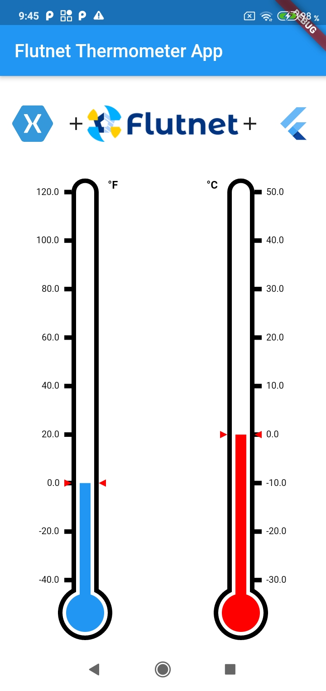

# Flutnet Thermometer

[Flutnet](https://www.flutnet.com) app example that use the usb [Device.Net](https://github.com/MelbourneDeveloper/Device.Net) library

## Features

- All the UI realized in Flutter using the library [flutter_thermometer](https://pub.dev/documentation/flutter_thermometer/latest/)
- The flutter code get the temperature value using a Xamarin class called **ThermometerService**
- The Xamarin backend use USB [Device.Net](https://github.com/MelbourneDeveloper/Device.Net) library

## Run the project for the first time

- With Xamarin installed, clone project and open the solution file **FlutnetThermometer.sln**
- Build the **FlutnetThermometer.ServiceLibrary** project: this will update the **flutnet_thermometer_bridge** package project.
- With Flutter 1.20.4 installed, go to `Flutter/flutnet_thermometer` project and run 
    - `flutter build aar --no-profile` (for Flutter Android)
- Before running **FlutnetThermometer.Android** project _ensure to manually uninstall the previus deployed application_ `com.example.app` from your device (see [Flutnet Known Issues page](https://www.flutnet.com/Download/Release-Notes/Known-Issues)). This procedure must be done every time you make changes to the Flutter module and you want these changes to be reflected inside the Xamarin Android application
    - `adb uninstall --user 0 com.example.app`
- Run the Xamarin project from Visual Studio

## Screenshots

